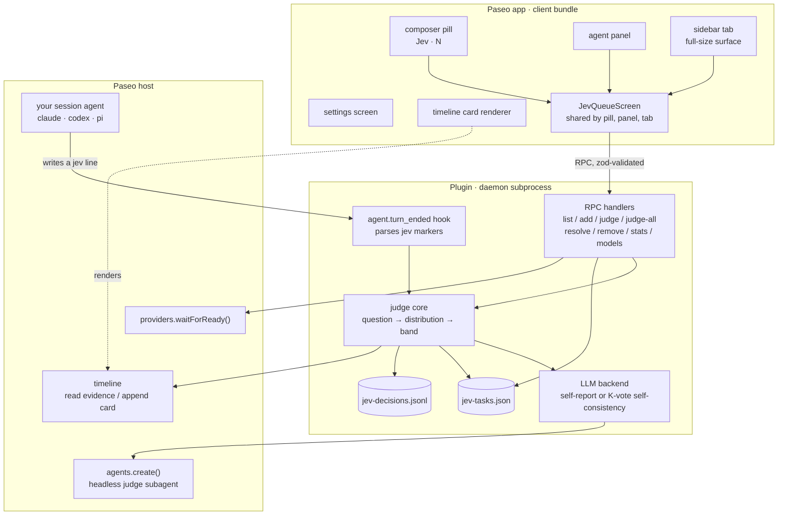
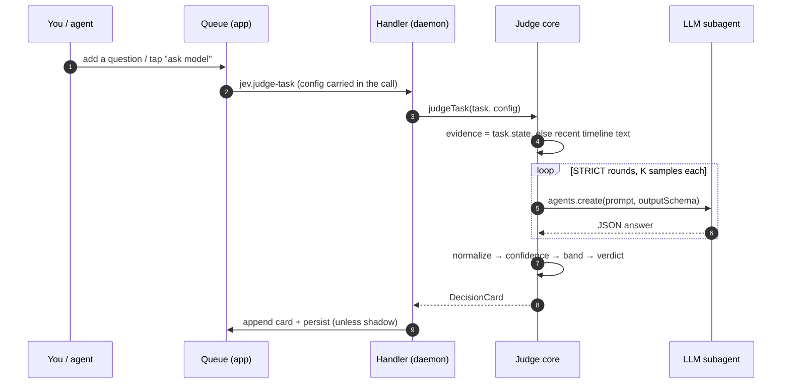
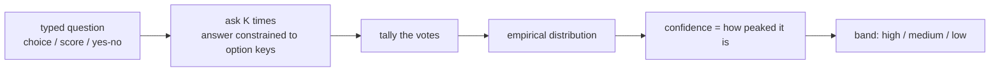

# jev-paseo

A Paseo plugin for making small, typed decisions inside a coding session. Which fix is safer? Is the diff risky enough to block? You queue the question, then pick the answer yourself or hand it to a model. The result shows up as a card in the session timeline: a probability with a confidence band.

It borrows the design of **jev**, TypeSafe's "System One" decision model, but it never calls jev or any hosted decision service. Nothing to sign up for, no API key. It rebuilds jev's shape (typed questions in, a calibrated distribution out) on top of whatever LLM you already run in Paseo.

## What it does

A decision here is one of three shapes, borrowed from jev:

- **choice**: pick one of N options.
- **score**: a level on an ordered scale (returns the expected level, e.g. `3.4 (good)`).
- **yes/no** (`noul`): the probability that the answer is yes.

Every answer carries a **confidence** derived from the distribution's shape, plus a **band**: *high* (act on it), *medium* (worth a second look), *low* (don't trust it). Under STRICT mode the judge re-asks until confidence clears your threshold, or it stops and returns "insufficient". That is the honest result when the evidence isn't there.

The unit of work is a **judge task**. The queue holds the pending ones; you open it from a pill next to the composer. Resolve a task by tapping an option, or hand it to a model. That model is just a `provider/model` string, so it can be Claude Code, Codex, pi, or anything else Paseo exposes.

## How it fits together

Paseo plugins split across two runtimes. Client code runs inside the app, server code runs as a subprocess of the daemon, and `shared/` compiles into both. The two halves talk over Zod-typed RPCs. The server never calls a model directly. It asks the Paseo host to spin up a throwaway subagent on the model you picked.



The judge subagent runs with an empty tool policy and a system prompt that tells it to return JSON and nothing else. No reading files, no running commands. Pointing it at a full coding agent won't set off a chain of tool calls or permission prompts.

The plugin also stays on Paseo's provider-neutral APIs. It reads the normalized timeline, so a Claude session and a Codex session look identical to it. "Works with claude/codex/pi" took zero per-provider code.

## A decision, start to finish



The call carries the config because on Paseo 0.8.0 the server can't read plugin settings on its own. The client can, so it sends them along. That keeps the backend and shadow mode working on the shipping runtime instead of falling back to defaults.

## Getting a calibrated answer out of a normal model

Here is where jev-paseo learns from jev instead of calling it. jev returns a calibrated distribution in one pass because it was trained to. We can't retrain a model, and Paseo's agents don't expose token logprobs, so this recovers the distribution by hand: ask the model the same typed question K times and count the answers. Vote share becomes the probability.



`samples = 1` skips the voting and asks the model to report a distribution in one shot. It's fast and cheap, though a self-reported number from an LLM carries little real calibration. `samples = 3` or `5` starts to mean something, at 3 to 5 times the cost. Pick the point on that curve you can afford. Either way the answer is schema-constrained, so the model can't return an option that doesn't exist. Constrained decoding gives you jev's "can't make a type error" property.

Voting only calibrates on a provider that samples, meaning temperature above zero. Claude Code and Codex do by default. Paseo exposes no model-agnostic temperature knob, so on a deterministic provider the K votes come back identical and the confidence collapses to 0 or 100 percent. The settings screen says so next to the samples control.

## Running it

Install it as a directory plugin. You need at least one provider configured in Paseo; that provider pool is where judge models come from.

```bash
paseo plugin install ./jev-paseo
```

In a session, open the **Jev** pill next to the composer. Add a question (and an optional description that gives you and the judge more context) with `＋ new`, or start from a preset (`verify`, `route`, `severity`, `guardrail`, and the rest of the common jev recipes). Resolve it by tapping an option, or pick a model under *decide with* and hit **ask**. "ask all" judges every pending task in one call. Each resolved decision becomes a card in the timeline, and the panel keeps a running log. A resolved row expands to that full card, and you can re-judge it with a different model from there. Pending rows carry edit and remove; toasts report each outcome. If you never set a judge model, the picker falls back to your provider's default so it works out of the box.

Want more room? Open **Jev** from the sidebar. It opens as its own tab like a session, lists your live sessions across the top, and shows the full-size queue for whichever one you pick. By default it **follows the session you're working in**: when you send a query somewhere, that agent goes `running` and the tab switches to it (Paseo has no "focused tab" event for plugins, so it tracks the running / most-recently-used agent over the `agents.list` subscription). Pick a session from the dropdown to pin it, or choose *Auto · follow active* to hand it back.

### Letting the agent ask

An agent can queue its own decisions by writing a marker line in its output:

```
[jev] choice: Which fix is safer? | rollback | hotfix
[jev] yn strict: Did the failing test pass?
[jev] score: Rate this diff's risk | trivial | low | medium | high | severe
```

Paseo won't let a plugin expose a tool to the agent or intercept a tool call before it runs. The marker is the seam that's left. An `agent.turn_ended` observer picks it up and turns it into a pending task, de-duped so asking twice doesn't queue twice. Two circuit breakers keep an eager agent from burning model calls: at most 5 markers queue per turn, and past 10 marker tasks in an hour the auto-judge stands down, so new questions wait for you instead. The hook parses markers the same way for every provider, so `claude`, `codex`, and `pi` all use it identically. Teaching the agent to write them is opt-in: flip `JEV_HOOK_INSTRUCT=1` to inject the convention into every agent, or run `bash integrations/install.sh` to drop it into the file each harness reads (Claude Code skill or `CLAUDE.md`, Codex `AGENTS.md`, Pi `APPEND_SYSTEM.md`). See [`integrations/`](integrations/).

Turn on **Send the verdict back to the agent** in Settings → Jev (or set `JEV_FEEDBACK=1`, which also covers the auto-judge path) to close the loop: when a task resolves (a model judged it or you picked), jev sends the decision back into that session with `agents.send`, so the coding agent reads the verdict and keeps going. One habit worth stealing from loop engineering: pick a judge model from a different provider than the session's agent, so the agent is not grading its own homework with its own weights. By default it fires only for tasks the agent pushed via a marker; flip the second switch (or set `JEV_FEEDBACK_ALL=1`) to also feed back tasks you created yourself. A send failure never touches the resolution, and it stays off by default so a resolution doesn't interrupt you unasked.

### Knobs

Settings live under **Settings → Jev**. The env vars only matter for the agent-marker path, since that runs server-side and can't read the UI settings:

| Setting / env | What it does |
|---|---|
| Judge model | Default `provider/model` when a call doesn't override it. |
| Samples | 1 = fast self-report; ≥3 = calibrated voting (K× cost). |
| STRICT + threshold + max rounds | Re-judge until confidence clears the threshold, or stop and mark it insufficient. |
| Review floor | The `medium` / `low` band cutoff. |
| Shadow mode | Judge and log, but leave the task pending. The model's guess sits next to your own pick so the panel can show how often you two agree. |
| `JEV_HOOK_INSTRUCT=1` | Inject the marker convention into agent prompts. |
| `JEV_HOOK_AUTOJUDGE=1` + `JEV_HOOK_MODEL` / `JEV_HOOK_SAMPLES` | Auto-judge marker tasks instead of leaving them for you. |
| Send verdict back (setting) or `JEV_FEEDBACK=1` | Send a resolved marker task's verdict back into the agent's session. |
| Also your own tasks (setting) or `JEV_FEEDBACK_ALL=1` | Extend the feedback to tasks you created, not just marker ones. |

Tasks persist to `~/.paseo/plugin-data/jev-tasks.json`, and every decision (yours and the model's) is appended to `jev-decisions.jsonl`, which is what the agreement/regret stat reads. Tap the stats line under the queue to expand a calibration view: a model-confidence histogram, the band mix, and a recent-decisions strip (faded squares are your own picks). **Export CSV** there pulls the full decision log for that session so you can chart regret and agreement in a spreadsheet (desktop and web; on mobile it says so with a toast).

## What it doesn't do

It is not a System One model. The distributions are only as calibrated as the model you point at them and the number of samples you pay for, so treat the confidence as a rough signal and keep your own judgment on top. Decision cards are timeline rows the daemon appends, so they survive a reconnect but not a daemon restart. The task store and the model's transcript do persist. And it gates nothing: a jev verdict advises, and you decide what to do with it.

It also can't reach you when the app is backgrounded or on your phone. Paseo exposes no OS or push notification API to plugins (only the pill badge and an in-app toast), so a pending decision waits for you to look. The one native signal is the "agent finished" notification when the agent that asked ends its turn. There's a write-up of what a plugin notification API could look like in [docs/paseo-plugin-notifications-request.md](docs/paseo-plugin-notifications-request.md).

## Working on it

```bash
npm install
npm test        # vitest: contract math, judge loop, backends, handlers, marker parser
npm run typecheck
npm run demo    # the whole pipeline end to end with a scripted model, no daemon needed
```

The decision logic stays free of the Paseo SDK: the confidence math, the multi-round loop, the vote tally, the marker grammar. That's where the ~110 tests live. The rest is thin glue and React Native UI. CI runs these three commands on every push.
